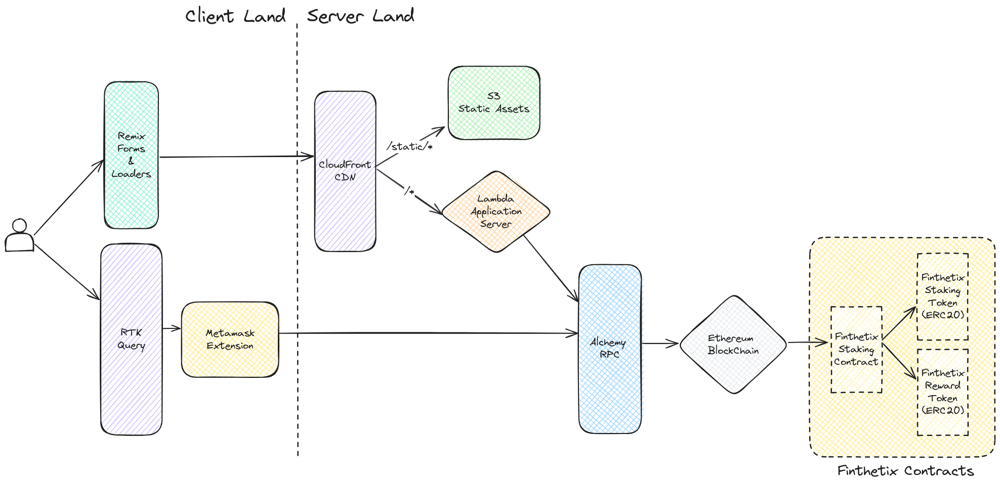

# Finthetix

Finthetix is a Staking Dapp heavily inspired by [Synthetix Stakng Rewards Contract](https://github.com/Synthetixio/synthetix/blob/develop/contracts/StakingRewards.sol). It uses Solidity (Foundry) for the Smart Contracts, and Remix-React and EthersJs for the web application. The web app is deployed on AWS Lambda and S3 (static assets), with AWS Cloudfront as the CDN. For more details, check out the [System Diagram](#system-diagram) below.

## Table of Contents
- [Motivation](#motivation)
- [System Diagram](#system-diagram)
- [Staking Contract](#staking-contract)
  - [Whitepaper](#cool-stuff-now-tell-me-how-whitepaper)
  - [Real world Examples](#give-me-some-examples)
  - [Thoughts on Foundry](#thoughts-on-foundry)
  - [Production Deployment](#production-deployment)
- [Web App](#web-app)
  - [Framework Layer](#framework-layer)
  - [Infrastructure Layer](#infrastructure-layer)
  - [Global State Management Layer](#global-state-management-layer)
  - [API Layer](#api-layer)
  - [API Cache Layer](#api-cache-layer)
  - [Type Layer](#type-layer)
  - [UI Layer](#ui-layer)
- [Closing Thoughts](#closing-thoughts)

## Motivation
I was going through the [Synthetix Stakng Rewards Contract](https://github.com/Synthetixio/synthetix/blob/develop/contracts/StakingRewards.sol), and all I could think is
> This is so unreadable. I'm having to jump around here and there; no proper control flow.

Naturally, with my hubris I thought I could do better. 

In hindsight, I have a great deal of appreciation for the devs who wrote that contract. Truly marvelous. I still feel that my initial remarks hold true, yet that doesn't mean I can't appreciate their ingenuity elsewhere. In Finthetix, I have tried to address first and foremost, these readability concerns on the smart contract. I think I have succeeded to some degree. But having to strike a balance between readability and gas optimization, I've optimized the contract as much as I could.

## System Diagram
<a href="https://raw.githubusercontent.com/sayandcode/finthetix/main/documentation/readme-pics/system-diagram.png" target="_blank">

</a>

The data flow is as follows.
- For Web3 Requests, the user talks to the API Cache Layer (RTK Query), which then relays it to Metamask via EthersJS' provider. Metamask then talks to the RPC Node ([Alchemy](https://www.alchemy.com/)), who then relays the message to the blockchain, where our Smart Contracts are deployed
- For Web2 requests, our Remix Loaders and Actions relay our requests to AWS CloudFront CDN. From there, it splits the requests into 
  - static requests, which go to our S3 bucket hosting static assets (CSS, JS, fonts, images etc.) and the 
  - dynamic requests, which hit our lambda function hosting our web server. The web server occasionally has to talk to our RPC (again, via EthersJS provider; no RTK Query tho) in order to fetch metadata about our Smart Contracts

  The CDN caches the responses from S3 and Lambda wherever possible, eliminating the load on our origin servers. For S3, the cache policy is the standard S3 caching-optimized policy. For Lambda, _Cache-Control_ headers are set on a per-route basis, which is respected by the CDN.


## Staking Contract 
The Finthetix Staking Contract is heavily based on the Synthetix Staking Contract. The latter grants out a fixed quantity of reward tokens at a specified interval. The addresses that stake for the contract are granted a portion of these reward tokens in proportion to their staked amount relative to the total quantity of staked tokens.

Implementing the same in [Solidity](https://soliditylang.org) however, requires some Mathematical gymnastics. The issue here is that Smart Contracts are intended to be extremely gas efficient at runtime, in order to minimize the transaction costs. This presents us with the impetus to offload the computational complexity of such an algorithm as it would normally be represented, by making use of mathematical constructs similar to indices.

In plain language, instead of storing all the data in its original form and conducting the calculation at the time of requirement, we store only the necessary data and preemptively conduct the required computations and store them in a running counter. 

This gives us two main benefits:
- No need to repeatedly run expensive computations
- The costs of expensive computations are distributed amongst the bulk of all transactions

### Cool stuff. Now tell me how? [Whitepaper]
#### Common sense approach

The rewards earned by a user would be given by the equation

$$r_{user,a\ to\ b}=\sum_{t=a}^{b}\dfrac{s_{user}}{s_{total}}R$$

Traditionally, this would mean calculating the reward earned at each discrete time interval and adding those all up. This doesn't seem like too much of a problem in normal programming terms. Except that you would have to store the amount staked by each user at every interval of time.

> RIP Storage, RIP Computation

We're used to the luxury of essentially infinite storage and compute in normal web programming. But the cost here is huge. The fact to consider here is that we don't really care about any of this information that's being stored.

#### So what do we care about?
The rewards owed to a user **now** is all we really care about. So instead of chosing to store the amount staked by a user at each interval, the first optimization is to simply compute and store the rewards owed in a simple counter.

$$Total\ rewards\ owed\ to\ a\ user,\ r_{user,total}$$

But this still doesn't absolve us of running that expensive computation to calculate the rewards. This is where the smart folks at Synthetix applied themselves. But more on that later.

The first thing we can think of doing is calculating the rewards owed to each user, whenever there is some change in the staked amount. This allows us to move out $s_{user}$ and $s_{total}$, as they are constants upto (but not at) the current time, b. As a matter of fact, even $R$, the rewards per second is constant.

$$r_{user,a\ to\ b}=R\dfrac{s_{user}}{s_{total}}\sum_{t=a}^b1$$

which can be simplified to

$$r_{user,a\ to\ b}=R\dfrac{s_{user}}{s_{total}}(b-a)$$

As you can see, the above equation doesn't require any loops. Thus we save on expensive computation. Now we just need to add this to the running counter.

$$r_{user,total(new)}=r_{user,total(current)}+r_{user,a\ to\ b}$$

#### Not so fast
The astute may have noted that while we are absolved of running any loops for computing the rewards for individual users, we still have to calculate the reward for each single user in our staking pool, at each interaction with the contract.

> for each user.... that's a loop!

Back to the drawing board. Let's take another look at our equation.

$$r_{user,a\ to\ b}=\sum_{t=a}^{b}\dfrac{s_{user}}{s_{total}}R$$

Our premise was solid: we extract those elements that don't require iteration (as they're constant), and iteratively compute a running counter for the rest. From that perspective, we can ask ourselves

> What is constant at each interaction with the smart contract?

The reward rate, $R$, obviously. But also, the amount staked by the user! Whenever the user interacts with the contract to change the amount staked, that change only affects computations that occur _subsequently_. So between any period of time $a$ and $b$, the reward earned by a user is

$$r_{user,a\ to\ b}=s_{user}R\sum_{t=a}^{b}\dfrac{1}{s_{total}}$$

So at the point of interaction with the contract, we only need to compute the above and store it to the running rewards counter $r_{user,total}$. And in this equation, the only piece of intensive computation is

$$S_{a\ to\ b} = \sum_{t=a}^{b}\dfrac{1}{s_{total}}$$

That doesn't look too good though. In order to compute this, we need to have in store the total amount staked in the contract, at every given instant. It's a huge improvement from having to store each user's staked amount at each instant. But we want to improve this even more.

Before we proceed, this is what we have so far

$$r_{user,a\ to\ b}=s_{user} \times R \times S_{a\ to\ b}$$


#### Let's put this in a running counter

In the spirit of what has worked for us so far, we could compute the value of $S$ at each interaction (where $s_{total}$ changes) and it to a counter, $S_{0\ to\ t_{now}}$.

$$S_{0\ to\ t_{now},\ new} = S_{0\ to\ t_{now},\ old} + \sum_{t=t_{last\ interaction\ of\ contract}}^{t_{now}}\dfrac{1}{s_{total}}$$

or

$$S_{0\ to\ t_{now},\ new} = S_{0\ to\ t_{now},\ old} + \dfrac{1}{s_{total}}(t_{now}-t_{last\ interaction\ of\ contract})$$

So this running counter is computing the sum of these values since the inception of the contract.

$$S_{0\ to\ t_{now}} = \sum_{t=0}^{t_{now}}\dfrac{1}{s_{total}}$$

What we require is only a subset of this running counter, which is the value from time $a$ to $b$, $S_{a\ to\ b}$.

In our case, we are only ever interested in the rewards owed at the current instant, not the historical rewards owed. So we can say that $b$ is always the current time, which is when the interaction happens with the contract. Similarly $a$ is when the user last interacted with the contract

$$a=t_{last\ interaction\ of\ user},\ b=t_{now}$$

So our requirement is

$$S_{t_{last\ interaction\ of\ user}\ to\ t_{now}} = \sum_{t=t_{last\ interaction\ of\ user}}^{t_{now}}\dfrac{1}{s_{total}}$$

To reiterate, our required value is a subset of our running counter. So our running counter is equal to our required value, plus some unknown value, $x$.

$$S_{0\ to\ t_{now}} = S_{t_{last\ interaction\ of\ user}\ to\ t_{now}} + x$$

or, calculating $x$

$$x=S_{0\ to\ t_{now}} - S_{t_{last\ interaction\ of\ user}\ to\ t_{now}} $$

$$x = \sum_{t=0}^{t_{now}}\dfrac{1}{s_{total}} - \sum_{t=t_{last\ interaction\ of\ user}}^{t_{now}}\dfrac{1}{s_{total}}$$

We can split the summation from $0$ to $t_{now}$ as the sum of summation from $0$ to $t_{last\ interaction\ of\ user}$ and $t_{last\ interaction\ of\ user}$ to $t_{now}$

$$x=(\sum_{t=0}^{t_{last\ interaction\ of\ user}}\dfrac{1}{s_{total}} + \sum_{t=t_{last\ interaction\ of\ user}}^{t_{now}}\dfrac{1}{s_{total}}) - \sum_{t=t_{last\ interaction\ of\ user}}^{t_{now}}\dfrac{1}{s_{total}}$$

Cancelling the common terms,

$$x=\sum_{t=0}^{t_{last\ interaction\ of\ user}}\dfrac{1}{s_{total}}$$

This is simply the value of our running counter, at the point the user last interacted with the contract.

$$x=S_{0\ to\ t_{last\ interaction\ of\ user}}$$

Plugging this back in to our earlier equation 

$$S_{0\ to\ t_{now}} = S_{t_{last\ interaction\ of\ user}\ to\ t_{now}} + x$$

$$S_{0\ to\ t_{now}} = S_{t_{last\ interaction\ of\ user}\ to\ t_{now}} + S_{0\ to\ t_{last\ interaction\ of\ user}}$$

And then rearranging to get our required value, 

$$S_{t_{last\ interaction\ of\ user}\ to\ t_{now}} = S_{0\ to\ t_{now}} - S_{0\ to\ t_{last\ interaction\ of\ user}} $$


#### How does that help?

This essentially means that we only need to maintain one counter. Or to be more explicit, we only need to _compute_ one counter. But we maintain separately the value of this counter for each user, at the time the interact with the token. The value at each interaction is also stored as a variable.

The key advantage here is _no more loops!_ But we also massively reduced the number of variables to maintain; from $(2 \times n_{users} \times n_{interactions})$ variables to $n_{interations}$ variables to $n_{users}$ variables. This is advantageous as the number of users could be constant, increasing or decreasing. But in comparison, we eliminated having to maintain new variables at each interaction. 

As our protocol grows and becomes more successful, we can expect an increase in the number of interactions, and the _Total Value Locked(TVL)_. We don't necessarily need to be worried about the number of users growing. So our smart contract remains robust as the storage used doesn't grow linearly with time (and inevitably run out of space), but grows only as the userbase grows (which is a reasonable tradeoff!).

#### Show me the money
So every time the user interacts with the contract, we calculate the rewards earned since the last interaction

$$r_{user,t_{last\ interaction\ of\ user}\ to\ t_{now}} = s_{user} \times R \times S_{t_{last\ interaction\ of\ user}\ to\ t_{now}}$$

Here we can substitute $S_{t_{last\ interaction\ of\ user}\ to\ t_{now}}$ with the values from our running counters.

$$r_{user,t_{last\ interaction\ of\ user}\ to\ t_{now}} = s_{user} \times R \times (S_{0\ to\ t_{now}} - S_{0\ to\ t_{last\ interaction\ of\ user}}) $$

and add this value to the variable storing the absolute number of rewards they've earned

$$r_{user,total(new)}=r_{user,total(current)}+r_{user,t_{last\ interaction\ of\ user}\ to\ t_{now}}$$

When the user asks to redeem their tokens, we run the above calculation for total rewards, and give them their reward accordingly.

The final formulas which you see above involve no loops, just simple arithmetic. Aah math you beauty!

#### One last thing
Our setup works great to save gas and storage costs. However in Solidity, we also need to worry about floating point math. Namely, the lack of it. Our counter $S$ is supposed to store a fraction, and in Solidity fractions don't exist; any numbers smaller than 1 get rounded down to 0. So in order to keep track of $S$, we need to either:

- _Inflate the counter:_ Represent a fraction as a non-fractional number, keeping in mind that this is a workaround. This is acheived by multiplying the fraction by a large enough number. Later on, we divide this same number, so that the final result is accurate.

- _Change the counter:_ Track a different parameter, one that is derived downstream from the fractional number. This allows us to acheive the inflation (previous point) without introducing any new numbers or calculations downstream.

In this contract we have opted for the former. *Why?* We were able to create a very neat abstraction with our inflationary constant. Namely, this constant translates to a parameter that has a real world analog - Cooldown time. Let me explain.

We store our counter in an inflated format. Let's call this inflated counter $α$ (alpha).

$$α = C \times S$$

Here we have introduced an inflationary constant $C$, which is our cooldown constant. If we expand the above equation, to calculate $α$, we have:

$$α_{0\ to\ t_{now}} = C \times S_{0\ to\ now} $$
$$α_{0\ to\ t_{now}} = C \times \sum_{t=0}^{t_{now}}\dfrac{1}{s_{total}} $$
$$α_{0\ to\ t_{now}} = \sum_{t=0}^{t_{now}}\dfrac{C}{s_{total}} $$

Then our counter would be practically calculated as 

$$α_{0\ to\ t_{now},\ new} = α_{0\ to\ t_{now},\ old} + \sum_{t=t_{last\ interaction\ of\ user}}^{t_{now}}\dfrac{C}{s_{total}} $$

$$α_{0\ to\ t_{now},\ new} = α_{0\ to\ t_{now},\ old} + \dfrac{C}{s_{total}}(t_{now} - t_{last\ interaction\ of\ user}) $$

As you can see, with sufficiently large $C$ values, we are able to calculate the value of $α$ accrued in the time since the last interaction of any user with the contract, without the risk of the accrued counter being rounded down to $0$. 

Delightfully, this also lends itself to a real world analogy. Whenever the numerator $C(t_{now} - t_{last\ interaction\ of\ user})$ is not larger than the denominator $s_{total}$, we can say that the contract is cooling down, and prevent any interactions. 

*Why do we want this?* Because the alternative would be that for a large enough amount staked, interactions even within a reasonable period of time would essentially wipe out the rewards owed to the users. This is because the time difference is not enough to accrue a discrete increase in $α$. 

For instance, consider $C=10,\ s_{total}=100 $, then under 10 seconds, the accrued $α$ will always be under $1$, and will get rounded down to 0. We don't want to encourage this behaviour. Hence anytime the time differential is less than what's required to trigger a discrete reward, we revert the transaction. This means that we have defined our cooldown constant $C$ asthe following.

> Cooldown Constant, $C$ is the amount of tokens that need to be staked in the contract, for a cooldown time of 1 second.

Any amount of staked tokens less than this $C$ value would trigger shorter cooldown times. Conversely if the tokens staked were more, the cooldown time is more than one second, proportional to the staked amount. 

As you can see here, code has become policy. And this is arguably a good policy. *Why?* When the protocol is small and not much value is staked in it, we allow frequent interactions, allowing the protocol to grow unhindered. Conversely, when the protocol becomes larger, signified by increase in *TVL (Total Value Locked)*, we are not so worried about onboarding additional users. Users will patiently wait to become a part of successful protocols.

#### Okay, cooldown constant. Now what?

Now that we have a reliable counter, we can use it to calculate rewards. Keep in mind that we need to divide our results by the cooldown constant, in order to correct for the floating point inflation we did earlier.

$$r_{user,t_{last\ interaction\ of\ user}\ to\ t_{now}} = s_{user} \times R \times \dfrac{(α_{0\ to\ t_{now}} - α_{0\ to\ t_{last\ interaction\ of\ user}})}{C} $$

and obviously, add this value to the variable storing the absolute number of rewards they've earned

$$r_{user,total(new)}=r_{user,total(current)}+r_{user,t_{last\ interaction\ of\ user}\ to\ t_{now}}$$

Keep in mind that in Solidity, all math is susceptible to overflows. But that's not unique to this contract! Check out [Mikhail Vladimirov's articles on this topic](https://medium.com/coinmonks/math-in-solidity-part-1-numbers-384c8377f26d) for more info there.

Our logic is now rock solid! *Huzzah!*

### Give me some examples

Hopefully by now you have a solid understanding of the logic for the Staking Contract. If you don't, check out [Smart Contract Programmer's videos](https://www.youtube.com/watch?v=6ZO5aYg1GI8&pp=ygUjc21hcnQgY29udHJhY3QgcHJvZ3JhbW1lciBzeW50aGV0aXg%3D) on this topic. He covers quite a few examples on this topic in his several videos.

<div style="display:flex; justify-content:center;">
<iframe width="560" height="315" src="https://www.youtube.com/embed/6ZO5aYg1GI8?si=XJV7P8oZ5iiaFhep" title="YouTube video player" frameborder="0" allow="accelerometer; autoplay; clipboard-write; encrypted-media; gyroscope; picture-in-picture; web-share" referrerpolicy="strict-origin-when-cross-origin" allowfullscreen></iframe>
</div>

### Thoughts on Foundry


Having to write the test cases in Solidity was probably a huge driver in getting me comfortable in this language. There were a lot of times when something as simple as creating a test data set were annoyingly contrived in Solidity. However in hindsight, the tests are better off the way they are now - simpler. Plus, [Foundry](https://book.getfoundry.sh/)'s Standard testing library quite helped out a lot. Will probably try out Hardhat once just get an accurate reading between the two.

### Production Deployment


Initially, I deployed this Smart Contract to [Sepolia Testnet](https://www.alchemy.com/overviews/sepolia-testnet). However the transactions were so slow, that I understood that realistically, noone would sit through this just to try out the Dapp. So I deployed it to [Polygon Mumbai Testnet](https://www.alchemy.com/overviews/mumbai-testnet). ~~Gotta say, I'm super happy. The gas fees are really low, and the transactions are super quick. I hope the mainnet experience is the same!~~ Aaand they decided to deprecate Mumbai Testnet 😕. I tried migrating to Amoy, but polygonscan doesn't support it yet, and I wanted to keep using `forge script`'s verify functionality. Cardona-zkEVM testnet was also considered, but it doesn't support EIP1559 yet (and foundry doesn't recognize the `--chain` name either). 

Finally I decided to go with Arbitrum Sepolia - native etherscan explorer, all the features of mainnet, nuff said.

Deployments are done using Foundry's `forge script` tool. We source the secret keys from our cast wallet, for maximum security. [Thanks Patrick Collins!](https://www.youtube.com/watch?v=VQe7cIpaE54). The script itself is used as part of our Foundry tests, so we know it's legit.

## Web App
### Framework Layer


For the web application framework I went with [Remix](https://remix.run/). I've been loving Remix lately for its ethos of _"Bring your own server"_ and _"Just web fundamentals"_. Having to deal with [MeteorJs](https://www.meteor.com/) at work, I've come to appreciate the _lack_ of abstraction in data flow. 

Yes, Remix also has its fair share of data-flow abstractions. Yes, this is probably a skill issue on my end, and I would be better off if I read the Meteor source code end to end. But at some point you realize that your new JS framework isn't offering you much more than the previous one, and that you'd be much better off having one web-fundamentals based framework (I even considered learning PHP. _*gasp*_). I don't want my framework to do everything for me. Just the bare minimum - render and bundle. I'll decide when and where to load data.

Again, yes, Remix provides abstractions for data loading; and I did have to read the docs end to end to wrap my head around it. But the Remix devs have this insistence on web fundamentals and interopability with them, that it makes me confident that it's the last Web Framework I need to learn. That means more time building apps, less time looking at esoteric Devtools for Network Requests (I'm looking at you [Meteor DDP](https://blog.meteor.com/introducing-ddp-6b40c6aff27d))

In all fairness, I could have gone with a client only bundle like [Vite](https://vitejs.dev/). But I wanted the user to get a fully rendered first paint (for UX) and better indexing by search engines (I'm not using a separate framework for the landing page). That's just not possible with Client-only apps. In hindsight, I also now have the benefit of updating env variables without having to deploy the bundle once again.

### Infrastructure Layer


I host the application on [AWS](https://aws.amazon.com/). I like AWS cause it's so pervasive, it's a web standard at this point. Plus, I get to host the entire stack on the same vendor (for the most part), using Infrastructure as Code. I like [AWS CDK](https://aws.amazon.com/cdk/) for this purpose, since it gives me almost the same experience as the web console- It tells me what properties are mandatory, and what combinations of properties won't work together. Usually this is my IaC flow:
  - Manually configure resources in a test environment, using the AWS Management Web Console
  - Generate [CloudFormation YAML](https://docs.aws.amazon.com/AWSCloudFormation/latest/UserGuide/template-formats.html) template using [former2](https://former2.com/)
  - Write the AWS CDK code by looking at the CloudFormation YAML

However for this project, I skipped step 2 above. The resources I used were sufficiently simple for me to write the AWS CDK code immediately after knowing which buttons to press on the AWS Management Web Console. This is my second time using AWS CDK. Probably keeping this as a go-to in my toolbelt. It's quite powerful.

The stack here is basically:
- A lambda running the web server. The web server itself is express with a remix handler configured to run on every route (except special ones like favicon)
- [AWS S3](https://aws.amazon.com/s3/) hosting the static build assets
- [AWS CloudFront CDN](https://aws.amazon.com/cloudfront/) sitting in front of these, providing caching and the first level of routing. All `/static` requests are routed to S3, rest to the lambda.

Cache Control Headers are set by the individual route handlers on the web server (Remix) itself, and these are made to be respected by CloudFront. The static assets are cached with a mainstream S3 caching policy managed by AWS.

### Global State Management Layer


I used [Redux](https://redux-toolkit.js.org/) for this purpose. The last time I worked with Redux was at my first job, building [Oyebusy.com](oyebusy.com). I remembered I was quite comfortable with the slices, actions and thunks provided by RTK query. So confident in fact that [my answer on Redux Toolkit](https://stackoverflow.com/a/74491857/18620006) (Query tho) is quite popular with the Stack Overflowians (even the official Redux maintainer endorsed it! 😁)

Alright, enough flexing. So I went with Redux this time because everyone seems to be using it more than other State Management tools like Zustand or Jotai(which I actually wanted to try). Now you might read this statement of mine and think

> Umm actually you shouldn't base your Technical Decisions based on what's popular right now in Javascript land

To which I would say, yeah you're right! But the version of that argument I'm going for is that for things like Redux (or even React for that matter), the network effects have really kicked in. If I was starting a development team from scratch, I would pick Redux, because we don't have to spend time training someone new to the team. If they've used Global State Management before, chances are the tool they've used is Redux. Plus everything is suuuper easy with Redux Toolkit.

I did slightly struggle with setting up the persistence with local storage and all; mainly because I couldn't get the [Redux Persist](https://www.npmjs.com/package/redux-persist) to work. In the end I rolled my own persistence logic. It's scoped by redux slice, and runs like a post-hook. I call them `Persisters` and `remember`'s. Pretty simple stuff really; good thing I didn't use a library for that.

### API Layer
Remix provides its own end-to-end typesafe API layer which is [Actions and Loaders](https://remix.run/docs/en/main/discussion/data-flow). I've used loaders to load in the data, however this project did not warrant the use of actions. Initially I tried to set up a cookie-based server side rendered page for authenticated users. But I decided that I want to save dat $$$ by making all pages static and caching them on the CDN. _Client wants data? Let them fetch it._


This is similar to how ecommerce websites operate. We are caching the commonly used public pages, and then handle the authentication logic to provide user-specific customization (like Avatar in Navbar) using client side requests post client render. In our case the authentication endpoint is not on our server, but rather on the client-side [Metamask](https://metamask.io/) extension.


The main network requests made by the client (apart from the various web pages), is for interacting with the blockchain. For that, I used [EthersJS](https://docs.ethers.org/v6/) and Metamask as the Web3 Provider. I had my eyes on Viem, but I felt it was better to get good at the fundamentals before jumping on an abstraction. This has served me well in the past when building apps with VanillaJS vs using React, because I actually understand what's going on under the hood.

Unfortunately this does come with the drawback that Finthetix (this app) currently supports only Metamask Wallets. Maybe next time I will use something like RainbowKit or Wallet Connect. No need to reinvent the wheel here. Probably going to stay clear of thirdweb. It looks cool, but I'd like to avoid vendor lock-in if possible.

### API Cache layer
<div style="text-align: center;">

</div>

I'm using Redux Toolkit for the Global State Management. So it was only natural to use [RTK Query](https://redux-toolkit.js.org/rtk-query/overview) for the API cache layer. It was either this or [React Query](https://www.npmjs.com/package/@tanstack/react-query) (whose API seems so elegant). But in the end, the decision was made by bundle size, not me.

> If you are using RTK already: 
>
> &nbsp;&nbsp;&nbsp;&nbsp; 9kb for RTK Query and ~2kb for the hooks.
>
> If you are not using RTK already:
>
> &nbsp;&nbsp;&nbsp;&nbsp; Without React: 17 kB for RTK+dependencies+RTK Query
>
> &nbsp;&nbsp;&nbsp;&nbsp; With React: 19kB + React-Redux, which is a peer dependency

I'm routing most of the data requests through RTK query. This helps me invalidate caches for queries when any kind of mutation happens. For example when the user changes their active address, I invalidate the user data cache, automatically causing the user data to be refetched. It happens quite magically.

I'm actually using several layers of abstraction for this network layer. This is following [Uncle Bob](https://en.wikipedia.org/wiki/Robert_C._Martin)'s recommendation that you should never call driver code directly in your business logic. This is also known formally as [Dependency Inversion](https://en.wikipedia.org/wiki/Dependency_inversion_principle), and is one of the [SOLID principles](https://en.wikipedia.org/wiki/SOLID). The abstraction layers look roughly like this.

```js
class RTKQuery {
  class FinthetixContractHandler {
    class MetamaskHandler {
      // in here I instantiate the ethers provider 
      // and call its methods
    }
  }
}
```

### Type Layer


I used [Typescript](https://www.typescriptlang.org/); obviously. I also used [Zod](https://zod.dev/) for the runtime typechecks. The API is really elegant, and I'm quite effective with it. 

The types for the Smart Contract are being generated at compile-time, by [TypeChain](https://github.com/dethcrypto/TypeChain). It basically looks at your compiled ABI and extracts the types from it. We use these types to create ContractHandlers generated by their respective factories. This stuff is designed with EthersJs in mind, so interop was just beautiful.

<div style="display: flex; justify-content: center;">
<blockquote class="twitter-tweet"><p lang="en" dir="ltr"><a href="https://twitter.com/hashtag/typechain?src=hash&amp;ref_src=twsrc%5Etfw">#typechain</a> was suuper easy to set up (despite the docs calling themselves legacy/antiquated). Thanks a ton <a href="https://twitter.com/dethcrypto?ref_src=twsrc%5Etfw">@dethcrypto</a> for the awesome work! <a href="https://t.co/eqco8xnZPR">pic.twitter.com/eqco8xnZPR</a></p>&mdash; sayandcode (@sayandcode) <a href="https://twitter.com/sayandcode/status/1751954115721400353?ref_src=twsrc%5Etfw">January 29, 2024</a></blockquote> <script async src="https://platform.twitter.com/widgets.js" charset="utf-8"></script>
</div>

I also have ESLint set up for linting. I used [ESLint Stylistic](eslint.style) for the config. The USP was one-stop setup; no more hunting for plugins. True for the most part; just had to set up the typescript-eslint-parser (for remix that's already done tho).

### UI Layer
<div style="text-align: center;">

</div>

I used [shadcnUI](https://ui.shadcn.com/) for the component library. My favourite thing about this library is the ethos of _"Own your components"_ (seeing a theme here, fellow libertarians?). Naturally, with this ethos this library also uses [Tailwind](https://tailwindcss.com/).

What I love about tailwind is that it gives you the freedom to create new components without having to worry about some esoteric styling framework and class-name setup you have set up globally. If I want to share styles, I'll make a component. Yes, styled components, modular css all provide the same benefit. But tailwind is better than
  - [Styled Components](https://styled-components.com/), because tailwind is waay lighter. No Js-in-Css. Just plain ol' classes. Same advantage against component libraries like [Material UI](https://mui.com/)
  - [Modular CSS](https://css-tricks.com/css-modules-part-1-need/), because tailwind comes with a style/design system out of the box. (Let's face it, most devs don't even bother about this stuff)

With shadcn on top of this, I essentially get a boost by not having to set up components that are essentially web standards at this point, while at the same having that flexibility to make changes as I please. And also if you didn't already know, shadcn is sessentially a RadixUI wrapper, so it brings with it all the accessibility and navigability benefits as well. I'm really thankful for this whole chain of tools.

For charting I used [ChartJS](https://www.chartjs.org/) and its wrapper, [React-ChartJS](https://react-chartjs-2.js.org/). Initially, I used [Recharts](https://recharts.org/en-US/), but that made it insanely difficult to do anything beyond the boilerplate they provide. Even the docs are horrible. It amazes me that there are so many Javascript charting libraries on npm, yet the docs are so bad for all of them.

Also, I hoped you liked the animation on the homepage. It took me some time to get right. It's all CSS properties, so performant af. However, I would have liked to use something like threeJS instead. It's amazing that the difference between a _plain ol website_ and _this is cool_ may just be a pinch of animation. On that note I also hope you liked the card hovers on the homepage and dashboard. That's inspired by Codecademy and StakingRewards.com

I spent a lot of time handling error paths in this project. At work, we faced an issue in the past (now resolved) where we had a tough time narrowing down the reason for client side errors, due to generic error messages. With this foresight, I followed an approach in this project, where each possible error location has a unique error code (for narrowing done the area of search). Further, each error code has several error descriptions that can accompany it, based on the actual step at which the error occurred. That way, the user has some closure and can take some actions on their own without having to contact tech support.

## Closing Thoughts
This project took me around 3 months to build. That's 3 months of giving up free time, early mornings, weekends and social events. Probably took so long because it was a part time effort. Nevertheless, the project acheived its objective, which was to teach me Web3 development. Although the scope of the project is quite limited vis-a-vis what the user can do (the web app is essentially a CRUD wrapper), the foundations (API, cache cache, abstracions, error handling, UI interactions) are rock solid, and no less than any production grade application.

However the sad part is that Finthetix dies the second I finish writing this README. That, it does not deserve. Like I said, Finthetix met its objective (teach me Web3), but it could be so much more. It could be an actual app used by people, not just a showpiece on my portfolio.

So that's what I've decided. Going forward, my personal projects are either going to be much smaller in scope (help me learn a specific aspect), or with an aim of long term viability - something actual people use, and hence I can justify keep coming back to maintain.

It's been a lot of fun, this past phase. See you in the next one.

_Onward and Upward_